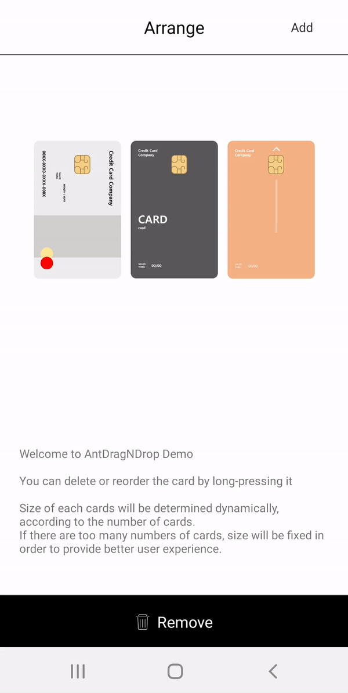
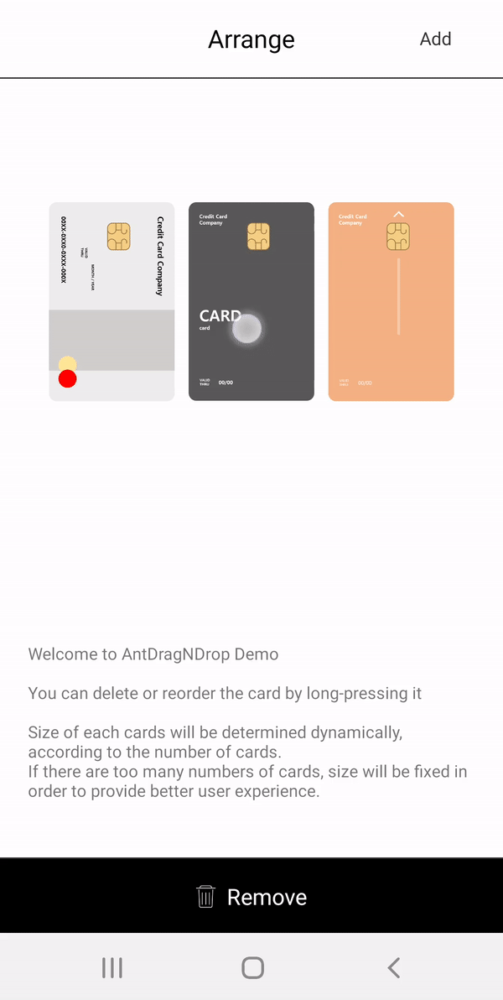
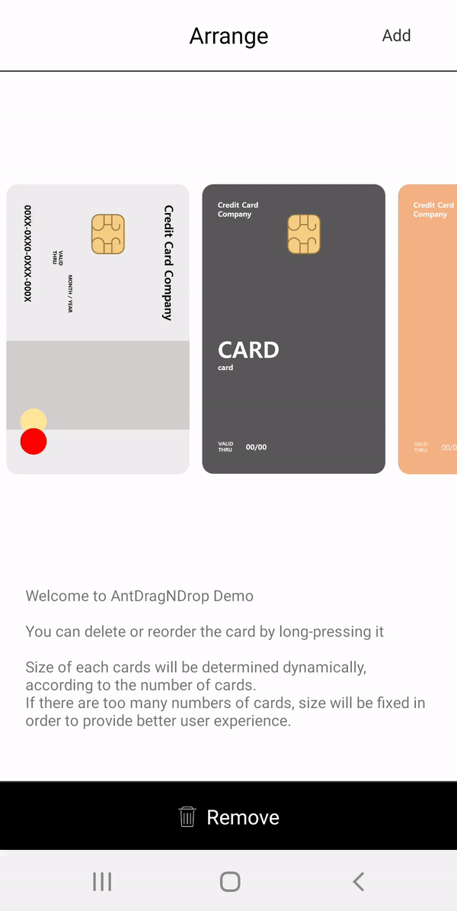

# Ant-DragNDrop
Drag-N-Drop-able list with recycler view

<table>

<tr>
<td>
Swipe change (reorder)
</td>
<td>
Deletable items  
</td>
<td>
For bigger items  
</td>
</tr>

<tr>
</tr>

<tr>
<td>

</td>
<td>

</td>
<td>

</td>
</tr>

</table>


## Usage

Assemble the card list to represent the images you have

You can modify the items in ```model/Card.java```

```java
ArrayList<Card> cardList = new ArrayList<>();
cardList.add(new Card(0, "Card1", getResources().getDrawable(R.drawable.card1)));
cardList.add(new Card(0, "Card2", getResources().getDrawable(R.drawable.card2)));
cardList.add(new Card(0, "Card3", getResources().getDrawable(R.drawable.card3)));
cardList.add(new Card(0, "Card4", getResources().getDrawable(R.drawable.card4)));
```

Define an recyclerView with ```android:orientation="horizontal"``` attribute

```xml
<androidx.recyclerview.widget.RecyclerView
	android:layout_gravity="center"
	android:id="@+id/recyclerView"
	android:layout_width="wrap_content"
	android:layout_height="wrap_content"
	android:fadingEdge="none"
	android:orientation="horizontal"
	android:scrollbars="none" />
```

Attach ```DragNDropRecyclerView``` with predefined data list and recyclerView

```java
RecyclerView recyclerView = findViewById(R.id.recyclerView);
new DragNDropRecyclerView(CardArrangeActivity.this) {
	@Override
	public void onDataChanged(ArrayList<Card> arrayList) {
		
	}

	@Override
	public void onDragEnded(float v, float v1) {
		
	}

	@Override
	public void onDeleted(Card card) {
		
	}

	@Override
	public void onCardEnter(boolean b) {
		
	}

	@Override
	public void onCardSelected(String s) {
		
	}
}.initView(recyclerView, cardList);
```

### License
```
MIT License

Copyright (c) 2022 Hyunseok Shim

Permission is hereby granted, free of charge, to any person obtaining a copy
of this software and associated documentation files (the "Software"), to deal
in the Software without restriction, including without limitation the rights
to use, copy, modify, merge, publish, distribute, sublicense, and/or sell
copies of the Software, and to permit persons to whom the Software is
furnished to do so, subject to the following conditions:

The above copyright notice and this permission notice shall be included in all
copies or substantial portions of the Software.

THE SOFTWARE IS PROVIDED "AS IS", WITHOUT WARRANTY OF ANY KIND, EXPRESS OR
IMPLIED, INCLUDING BUT NOT LIMITED TO THE WARRANTIES OF MERCHANTABILITY,
FITNESS FOR A PARTICULAR PURPOSE AND NONINFRINGEMENT. IN NO EVENT SHALL THE
AUTHORS OR COPYRIGHT HOLDERS BE LIABLE FOR ANY CLAIM, DAMAGES OR OTHER
LIABILITY, WHETHER IN AN ACTION OF CONTRACT, TORT OR OTHERWISE, ARISING FROM,
OUT OF OR IN CONNECTION WITH THE SOFTWARE OR THE USE OR OTHER DEALINGS IN THE
SOFTWARE.
```
